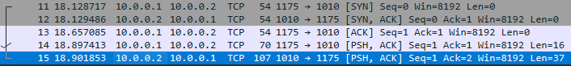
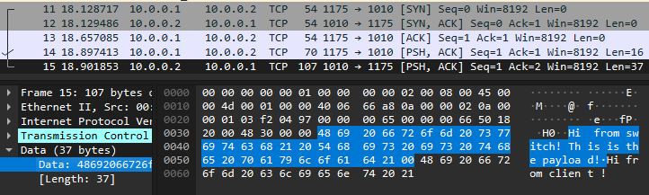
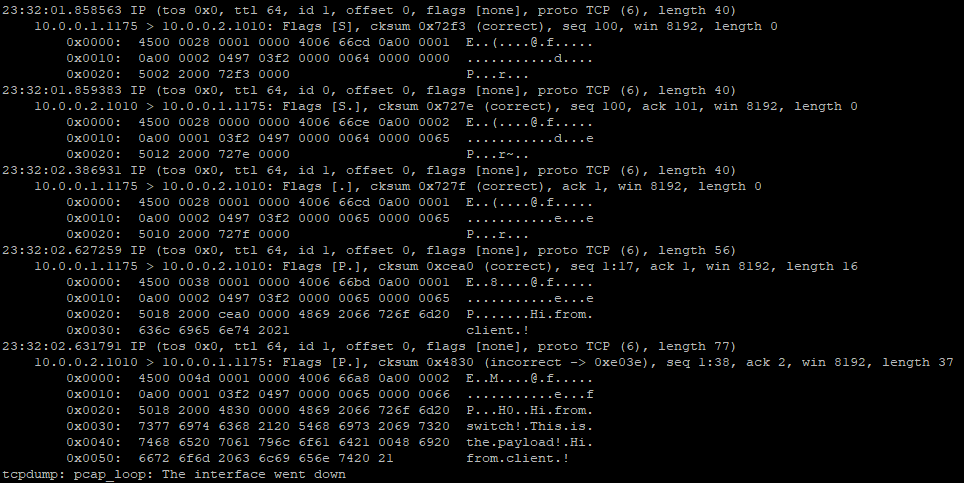
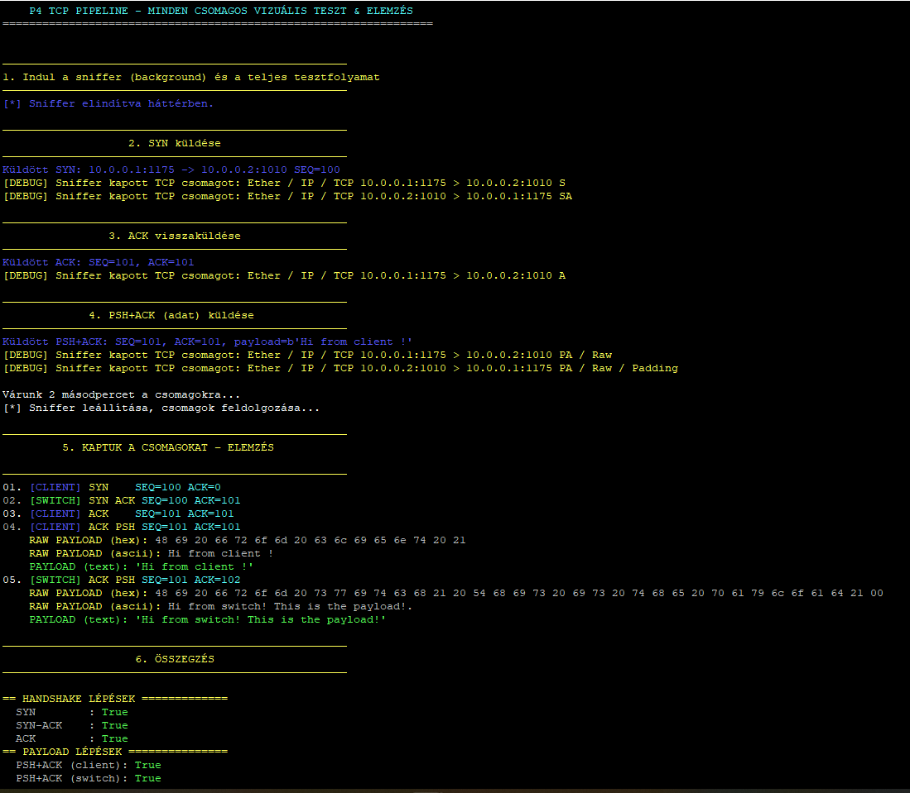
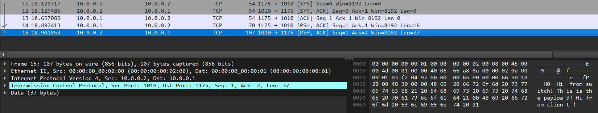

# elte-ik-msc-p4
Minimális TCP szerver implementálása P4 nyelven.

# Minimális TCP Handshake P4 Switch

Ez a projekt az ELTE IK Programtervező Informatikus MSC képzés ben a Programable Networks tárgy keretein belül egy **P4 switch-et** implementál, amely képes kezelni a TCP **SYN** és **SYN-ACK** csomagokat, és válaszol egy minimális, statikus payload-ot tartalmazó **PSH-ACK** csomaggal. A célja a TCP handshake minimális logikájának szimulálása egy P4-es switch-en keresztül.

## 🚀 Projekt célja

A projekt célja, hogy egy egyszerű **TCP handshake** logikát implementáljon P4-ben, amely:

- Felismeri a **TCP SYN** csomagot
- **SYN-ACK** választ küld vissza
- **PSH-ACK** csomagban **dummy válasz** (pl. `"Hi from switch!"`) küld vissza, mint statikus adat
- **Eegy helyes TCP kommunikácót szimulál**

A projekt az alábbiakból áll:

1. **P4 program** a TCP handshake kezeléséhez
2. **Mininet topológia** a virtuális hálózati környezethez
3. **Scapy tesztelés** a válaszok automatikus ellenőrzésére


## 🖧 Hálózati topológia:
```
     +--------+                     +--------+ 
     |        |        h1-eth0      |        |
     |  Host  |---------------------|   s1   |
     |   h1   |                     | switch |
     +--------+                     +--------+ 
      IP: 10.0.0.1:1175         10.0.0.2:1010
      MAC:00:00:00:00:00:01     00:00:00:00:02:00
```

    - h1 küldi a TCP SYN-t 10.0.0.2:1010 címre (ez a "szerver" port).

    - s1 P4 switch felismeri a SYN-t, válaszol SYN-ACK-kal, srcPort=1010, dstPort=1175

    - h1 válaszol ACK-al.

    - h1 válaszol PSH-ACK csomaggal (adatküldés).

    - s1 újra válaszol dummy PSH-ACK-kal (adatküldés).

## 📬 IP-k és Portok

### Scapy teszt:

dst_ip = "10.0.0.2"     # s1 IP-je – A switch küld választ

dst_port = 1010        # "szerver" port (switch oldalon)

src_port = 1175         # "kliens" port

## 🧰 Követelmények

- **P4C** (P4 Compiler) telepítése
- **Mininet** telepítése
- **Scapy** Python könyvtár
- **Python3** a teszteléshez

## ⚙️ Telepítés és futtatás

1. **A projekt letöltése**

    Klónozd a repository-t:

    ```bash
    git clone https://github.com/SandorBalazsHU/elte-ik-msc-p4
    cd elte-ik-msc-p4
    ```

2. **P4 program fordítása, topológia indítása, Szabályok betöltése**

    A projekthez tartozik egy **automatikus bash szkript** is, amely egy lépésben végrehajtja az összes feladatot: a fordítást, a Mininet indítást, a szabályok betöltését és a szükséges beállításokat. Ehhez egyszerűen futtasd a következőt: (**Részletekért lásd a run_all.sh és tcp_topo.py fájlokat. A betöltött p4 kód a main.p4 fájlban található**):

    ```bash
    ./run_all.sh
    ```

3. **Tesztelés Scapy-val**

    A **Scapy** segítségével tudod tesztelni a TCP handshake működését. Futtasd a következő szkriptet a `h1` hostról:

    ```bash
    mininet> h1 sudo python3 tcp_test.py
    ```

    A script automatikusan küldi el a TCP SYN csomagot, várja a SYN-ACK válaszokat, majd PSH-ACK válasz küldésére figyel, ezeket naplózza és kiírja.

4. **A bezárás**
A program a mininet környezetből **exit** parancssal történő kilépés után automatikusan és szabályosan megszünteti a mininet környezetet és törli a lefordított p4 kódot, hogy legközelebb biztosan újraforduljon. 

## 📝 Kimenetek:
A program automatikusan ment minden csomagot ami be és ki érkezik a switch-ből. EzeK A log mappában vannak.

A ```bashpython3 upload.py``` program összefűzi és feltölti a szerverünkre a Wireshark fájlt, de a mappában ez kézzel is megtehető.

Hasznos lehet élőben is figyelni a kimenetet az alábbi parancssal egy másik terminálból:

```bash
sudo tcpdump -i s1-eth1 -nn -v

sudo tcpdump -i s1-eth1 -nn -v -X
```

## 📝 Minta kimenetek:

### Egy teljes kommunikáció:



### Küldött adat:



### Tcpdump a teljes kommunikációról:



### A tesztelés:



### Wireshark kimenet:



## 🔧 Jelenlegi állapot:
**HIBA MEGOLDVA:** 

**A hibajelenség:** A program valamiért az [S] csomag helyes felismerés után lezárja a kapcsolatot [R]. Ezt követi egy helyes válasz, de a kapcsolat már zárva.

**A hiba oka:** A virtuális gép valódi hálózati adapterként látja a mininet adaptereket így a TCP csomagokra reagál, ahogy a h1 host is.

**A megoldás:** Már nem kell kiadni ezeket az utasításokat, beépítésre kerültek a pipeline-ba. Ez meggátolja, hogy a VM host és a h1 host OS beleavatkozzon a TCP kapcsolatba.

```
A VM-en:
sudo iptables -A INPUT -i s1-eth1 -p tcp --dport 1010 -j DROP
sudo iptables -A INPUT -i s1-eth1 -p tcp --sport 1010 -j DROP
A h1 hoston:
h1 sudo iptables -A OUTPUT -p tcp --tcp-flags RST RST -j DROP
```

**A helyes lefutás:**
```
No.	Time	Source	Destination	Protocol	Length	Info
11	18.128717	10.0.0.1	10.0.0.2	TCP	54	1175 → 1010 [SYN] Seq=0 Win=8192 Len=0
12	18.129486	10.0.0.2	10.0.0.1	TCP	54	1010 → 1175 [SYN, ACK] Seq=0 Ack=1 Win=8192 Len=0
13	18.657085	10.0.0.1	10.0.0.2	TCP	54	1175 → 1010 [ACK] Seq=1 Ack=1 Win=8192 Len=0
14	18.897413	10.0.0.1	10.0.0.2	TCP	70	1175 → 1010 [PSH, ACK] Seq=1 Ack=1 Win=8192 Len=16
15	18.901853	10.0.0.2	10.0.0.1	TCP	107	1010 → 1175 [PSH, ACK] Seq=1 Ack=2 Win=8192 Len=37
```

## 📝 Megjegyzések

Ez a projekt egy egyszerű példát nyújt a **TCP handshake** minimális logikájának implementálására a P4-es nyelvben. Az alapvető cél az, hogy a P4 program képes legyen a TCP protokoll alapvető működését szimulálni.
